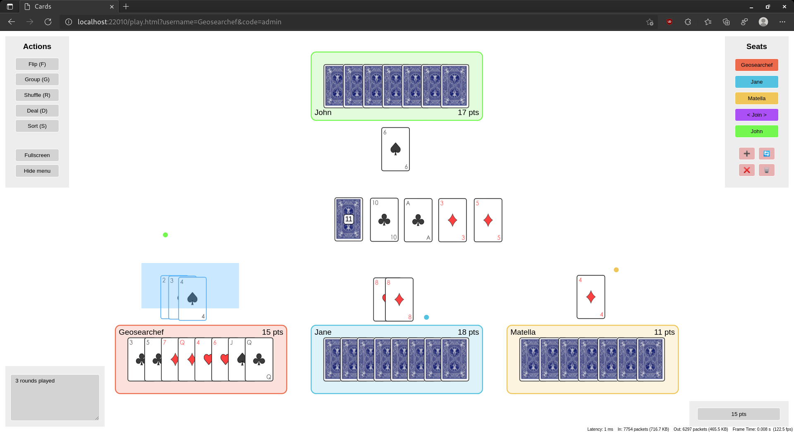
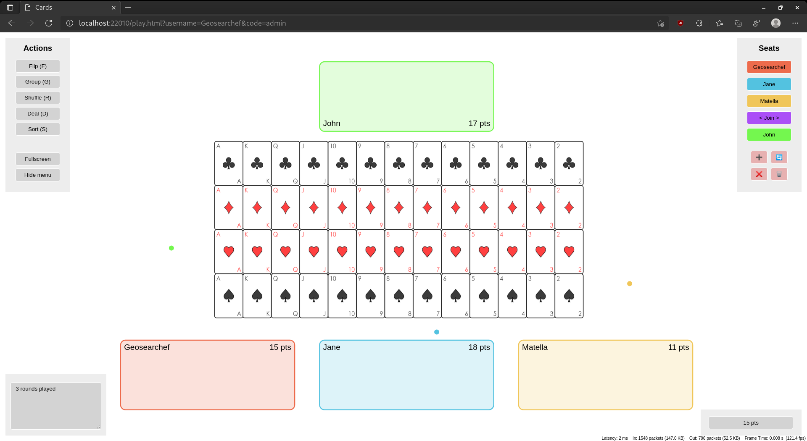

# Cards
Cards is a web based card game and tabletop simulator built using Kotlin. It allows playing card games with friends online in a barrier-less way as the only requirement is a modern

The implementation is based on Kotlin/JS with HTML5 rendering and WebSockets for the frontend and uses KotlinJVM on the backend.

The implementation is based on Kotlin/JS with HTML5 rendering and WebSockets for the frontend and uses KotlinJVM on the backend. It is open source and can be found in the respective git repository.

